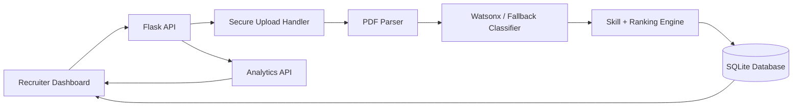

# AI Recruitment Intelligence Platform

An explainable AI resume screening dashboard built with Flask, JavaScript, SQLite, PDF parsing, and IBM watsonx.ai Granite. The project has been upgraded from a simple resume classifier into a portfolio-grade recruitment intelligence prototype.

## What It Does

- Upload and validate PDF resumes securely.
- Extract readable resume text.
- Classify candidates into approved job categories.
- Extract skills from resumes and job descriptions.
- Generate candidate scores and recruiter-friendly status labels.
- Explain why a candidate was classified, shortlisted, reviewed, or rejected.
- Store results in SQLite instead of browser-only history.
- Display dashboard metrics, candidate pipeline, charts, skill frequencies, and saved job roles.

## Target Users

- Recruiters screening multiple resumes.
- Placement cells shortlisting students.
- Students analyzing resume gaps.
- Internship and final-year project evaluators.
- Hackathon demo audiences looking for applied AI + full-stack delivery.

## Architecture



## Core APIs

| Method | Endpoint | Purpose |
| --- | --- | --- |
| `GET` | `/api/health` | Health check |
| `POST` | `/api/auth/register` | Register a local Admin, Recruiter, or Student account |
| `POST` | `/api/auth/login` | Login with a secure session cookie |
| `POST` | `/api/auth/logout` | Logout |
| `GET` | `/api/auth/me` | Get current logged-in user |
| `POST` | `/api/resumes` | Upload, classify, score, and store a resume |
| `POST` | `/api/resumes/batch` | Upload and rank multiple resumes |
| `GET` | `/api/resumes` | List analyzed candidates |
| `GET` | `/api/resumes/<id>` | Candidate detail, notes, and status history |
| `GET` | `/api/resumes/<id>/download` | Download a stored resume safely by id |
| `PATCH` | `/api/resumes/<id>/status` | Update candidate status |
| `POST` | `/api/resumes/<id>/notes` | Add recruiter notes |
| `POST` | `/api/resumes/<id>/match` | Match a resume against a job description |
| `GET` | `/api/resumes/<id>/guidance` | Generate student career guidance |
| `GET` | `/api/resumes/<id>/report.pdf` | Export candidate PDF report |
| `GET` | `/api/reports/candidates.csv` | Export candidate CSV report |
| `POST` | `/api/job-descriptions` | Save a job description and extract required skills |
| `GET` | `/api/job-descriptions` | List saved job descriptions |
| `GET` | `/api/analytics` | Dashboard summary and chart data |

## Database Tables

- `users`
- `resumes`
- `job_descriptions`
- `classifications`
- `candidate_scores`
- `feedback`
- `analytics`
- `audit_logs`

SQLite is used for the portfolio prototype. PostgreSQL is recommended for production.

## AI Output Format

The classifier now expects structured JSON:

```json
{
  "category": "Software Development",
  "confidence": 0.91,
  "skills": ["Python", "React", "SQL"],
  "experience_level": "Entry Level",
  "reason": "Strong evidence of full-stack development experience.",
  "recommended_roles": ["Backend Developer", "Full Stack Developer"]
}
```

If Watson credentials are unavailable or the model returns invalid JSON, the app falls back to a deterministic skill and keyword engine so demos still work.

## Local Setup

```bash
cd resume-screening-assistant
python -m venv .venv
.venv\Scripts\activate
pip install -r backend/requirements.txt
copy .env.example .env
python backend/main.py
```

Open `http://localhost:5000`.

For Watsonx-powered classification, set these in `.env`:

```env
USE_WATSONX=true
WATSONX_API_KEY=your-api-key
WATSONX_PROJECT_ID=your-project-id
WATSONX_URL=https://us-south.ml.cloud.ibm.com
```

## Docker

```bash
docker compose up --build
```

Open `http://localhost:5000`.

## Deployment

Render deployment is configured in `render.yaml` using Gunicorn:

```bash
gunicorn --chdir backend main:app --bind 0.0.0.0:$PORT
```

Recommended production setup:

- Frontend and backend on the same Flask app for simple demos, or frontend on Vercel and backend on Render.
- PostgreSQL via Supabase, Neon, or Render PostgreSQL.
- Uploaded resumes in encrypted object storage, not local disk.
- Strict `ALLOWED_ORIGINS` and secret environment variables.

## Security Improvements Included

- UUID stored filenames.
- `secure_filename()` for original names.
- PDF MIME and extension validation.
- Upload size limit via `MAX_UPLOAD_MB`.
- Restricted CORS via `ALLOWED_ORIGINS`.
- `debug=False` by default in production.
- Safe download route by resume id.
- Audit log table for important events.

## Demo Workflow

1. Register or login as a recruiter.
2. Use a fictional PDF from `data/demo_resumes/`.
3. Paste a job description and extract target skills.
4. Upload a candidate resume PDF.
5. Review category, confidence, extracted skills, score, and explanation.
6. Update candidate status from the pipeline table.
7. Download candidate PDF or CSV reports.

## Phase 2 Additions

- Bcrypt-backed authentication.
- Recruiter, student, and admin roles.
- Session-cookie login/logout.
- Candidate status workflow.
- PDF and CSV report exports.
- Five anonymized demo resumes.
- Semantic-lite resume/job matching.
- Dependency validation report.
- Live smoke test script.
- Sortable and paginated candidate table.
- Student Assistant guidance panel.
- Upload trend and score distribution analytics.
- Optional Sentence Transformer embeddings.
- Batch resume upload.
- Candidate detail view with notes and status history.
- Pytest unit tests.

See `docs/phase2_upgrade_report.md`, `docs/phase3_update_report.md`, `docs/phase4_update_report.md`, `docs/render_deployment_guide.md`, and `docs/dependency_validation_report.md`.

## Testing

With the Flask app running:

```bash
.venv\Scripts\python.exe backend\validation_report.py
.venv\Scripts\python.exe backend\smoke_tests.py
.venv\Scripts\pytest.exe tests
```

The smoke test registers a temporary recruiter, uploads a fictional demo resume, updates status, and verifies PDF/CSV export.

## Real Embeddings

The app supports optional Sentence Transformer embeddings for stronger resume-job matching:

```bash
pip install -r backend/requirements-embeddings.txt
```

```env
EMBEDDING_PROVIDER=sentence-transformers
SENTENCE_TRANSFORMER_MODEL=all-MiniLM-L6-v2
```

The default `local` provider remains available for fast demos and low-memory deployments.

## Original Demo Workflow

1. Paste a job description and extract target skills.
2. Upload a candidate resume PDF.
3. Review category, confidence, extracted skills, score, and explanation.
4. Use the candidate table to filter by status.
5. Show charts for categories, statuses, and skill frequency.
6. Export or download candidate records as part of the demo discussion.

## Resume-Ready Project Description

Built an explainable AI recruitment intelligence dashboard using Flask, IBM watsonx.ai, SQLite, and JavaScript to classify resumes, extract skills, score candidates, identify skill gaps, and visualize recruiter analytics through a production-oriented HR-tech interface.

## Future Scope

- JWT authentication with Admin, Recruiter, and Student roles.
- PostgreSQL migration.
- Embedding-based resume/job semantic matching.
- Bias detection and fairness reporting.
- Batch resume uploads.
- Student mode with resume improvement suggestions and learning roadmap generation.
- Evaluation suite with accuracy, precision, recall, F1 score, latency, and confusion matrix.

## Research Paper Direction

Title: Explainable AI-Based Resume Screening and Candidate Ranking Using Large Language Models and Semantic Matching

Possible contributions:

- Hybrid LLM + skill ontology extraction.
- Explainable ranking formula for recruiter decisions.
- Candidate-job semantic similarity using embeddings.
- Bias-aware filtering of protected attributes.
- Placement-cell dashboard for transparent shortlisting.
